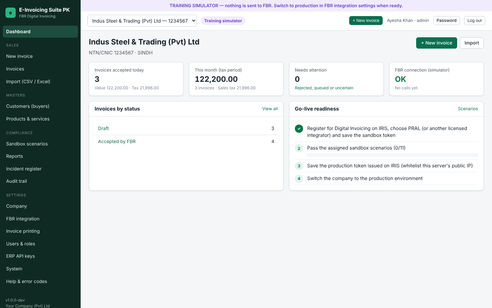
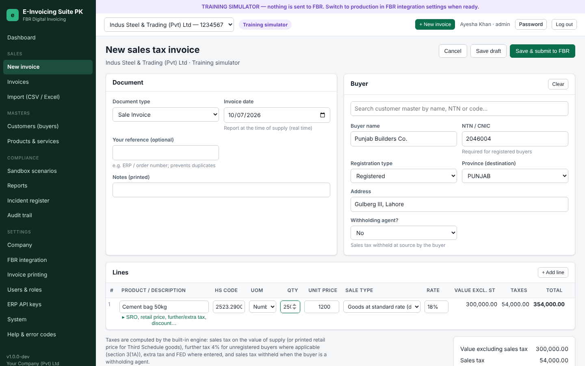
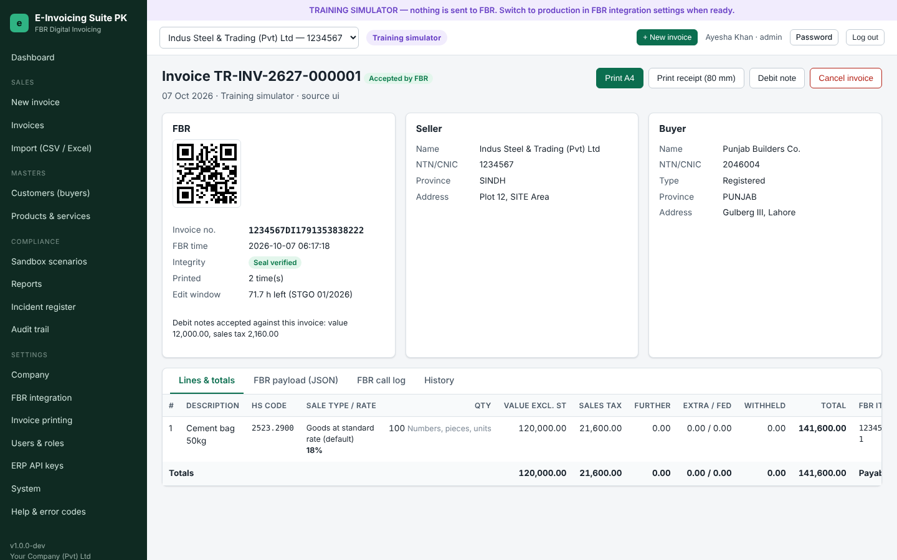
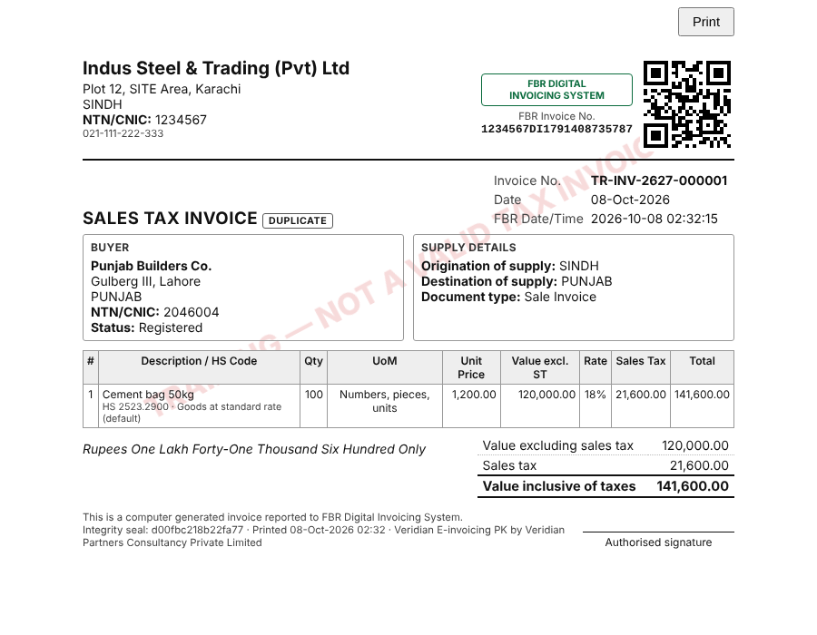
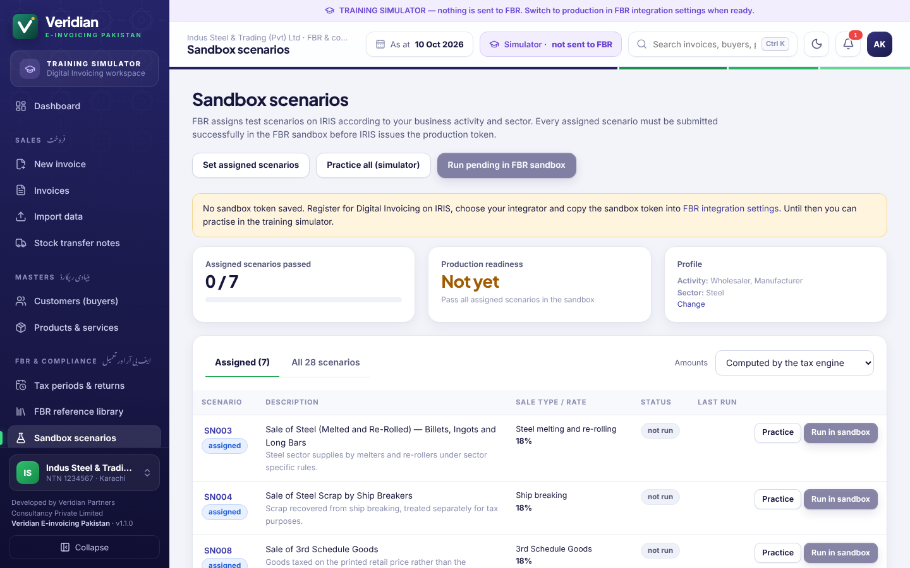
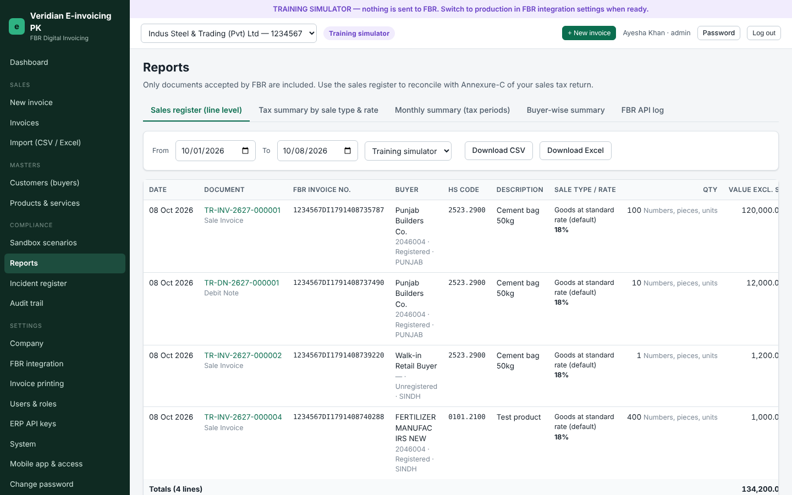

# Veridian E-invoicing PK

**Developed by Veridian Partners Consultancy Private Limited** · © 2026 All rights reserved.

**On-premise FBR Digital Invoicing software for Pakistani sales-tax registered businesses.**

The software:

- prepares sales tax invoices with Pakistan's sales-tax rules;
- validates them against FBR's rules;
- reports them to FBR's Digital Invoicing System in real time (DI API v1.12, through PRAL);
- prints compliant invoices with the FBR invoice number, QR code and FBR DI logo.

It is a single program with a built-in web interface. It is installed on the client's own server or PC. Staff use it from any browser on the office network, or as an installed app on Android and iPhone.

> Built to FBR DI technical specification v1.12 and Chapter XIV of the Sales Tax Rules 2006 (SRO 69(I)/2025). Each installation is certified for production through FBR's sandbox scenarios on IRIS. See [docs/FBR-COMPLIANCE-GUIDE.md](docs/FBR-COMPLIANCE-GUIDE.md).

## Screenshots

| Dashboard | Invoice entry with live tax calculation |
|---|---|
|  |  |
| **Accepted invoice with FBR number and QR code** | **Printed A4 tax invoice** |
|  |  |
| **Sandbox scenarios (FBR certification)** | **Reports (Annexure-C reconciliation)** |
|  |  |

## Features

**Invoicing**

- Sale invoices and debit notes.
- Live tax calculation: standard, reduced and zero rates, exempt supplies, Third Schedule retail price, per-unit and mixed rates (e.g. 18% + Rs 60/kg).
- Further tax (4%) for unregistered buyers, FED, extra tax, discounts, and withholding by withholding agents.

**FBR integration**

- Real-time reporting with an optional validate-first step.
- Safe handling of outages: invoices are queued and retried automatically.
- Ambiguous outcomes (timeouts) are marked **Needs reconciliation** and never resent blindly, so a sale is not reported twice.

**Sandbox certification**

- All 28 FBR scenarios (SN001–SN028) with FBR's sample data.
- Suggestions from your business activity and sector; one-click sandbox runs; a practice mode.

**Printing**

- A4 and 80 mm thermal formats.
- QR code version 2 (25×25) at 1 inch; FBR DI logo; amount in words (lakh/crore); buyer/seller/office copies; DUPLICATE marking on reprints.

**Compliance controls**

- Reported invoices are locked by database triggers.
- 72-hour cancellation rule, counted from FBR's issue time, with Commissioner approval tracking (STGO 01/2026). Optional cancellation through FBR's cancellation service once PRAL publishes it.
- Offline invoices: resent the moment FBR is reachable again, tracked on the dashboard until accepted (24-hour upload rule), with provisional "PENDING FBR REPORTING" printouts in the meantime.
- Section 23(1)(b): warns when a manufacturer or importer invoices an unregistered buyer without a real CNIC/NTN.
- Rule 150R incident register. FBR outages, token failures, crashes or power failures and tampering are detected automatically, and the letter to the Commissioner is generated for you.
- Hash-chained audit trail and tamper-evident invoice seals, checked automatically every day.

**Masters and data**

- Customers with FBR Active Taxpayer List checks.
- Products with HS code, UoM, sale type, rate and SRO lookups.
- CSV/Excel import with preview.

**Reports**

- Sales register (Annexure-C reconciliation), tax summary, monthly summary, buyer-wise summary.
- CSV/Excel export and a full FBR API log.

**Integration**

- REST API for ERP/POS systems: API keys, idempotent `externalRef`, raw FBR-payload pass-through.

**Mobile and web**

- Works in any browser on computers, tablets and phones, with a phone-friendly layout.
- Installs on Android and iPhone as an app (Progressive Web App) with its own icon; no app store needed.
- "Mobile app & access" page with QR codes to open the system on a phone, and a certificate download so phones trust the server.

**Administration**

- Multiple companies (NTNs); roles (admin, manager, accountant, operator, auditor).
- Encrypted FBR tokens; HTTPS; nightly backups.
- Windows service, Linux systemd unit or Docker.
- Built-in **training simulator** that works without FBR access.

**Commercial**

- Offline Ed25519 licences bound to client NTNs: 30-day evaluation, expiry, 15-day grace period, company/user limits.

## Quick start (try it in 2 minutes)

You need [Go 1.24+](https://go.dev/dl/). Node.js is **not** required because the built web UI is included in `internal/webui/dist`.

```sh
go run ./cmd/einvoice serve --data ./data --listen 127.0.0.1:8443 --no-tls
```

1. Open <http://127.0.0.1:8443/> and complete the setup wizard.
2. You start in the **Training simulator**: create customers, products and invoices, submit them, and print them. Nothing is sent to FBR.
3. When ready, follow [docs/FBR-ONBOARDING-GUIDE.md](docs/FBR-ONBOARDING-GUIDE.md) to connect to the FBR sandbox and production.

## Build

```sh
make test                                                   # run all tests
make build                                                  # dist/einvoice for this machine
make release VERSION=1.0.0 LICENSE_PUBKEY=<base64 key>      # Windows + Linux binaries in dist/
make web                                                    # rebuild the web UI (needs Node.js 18+)
```

Windows installer: compile `packaging/windows/einvoice-suite.iss` with Inno Setup 6 after `make release`. See [docs/LICENSING-AND-SALES.md](docs/LICENSING-AND-SALES.md) for generating the licence key pair and issuing client licences.

## Documentation

| Document | For |
|---|---|
| [docs/FBR-COMPLIANCE-GUIDE.md](docs/FBR-COMPLIANCE-GUIDE.md) | FBR DI legal framework, technical specification summary and requirement-by-requirement compliance matrix |
| [docs/FBR-ONBOARDING-GUIDE.md](docs/FBR-ONBOARDING-GUIDE.md) | Taking each client live: IRIS, sandbox scenarios, production token, day-to-day compliance; vendor approval paths |
| [docs/INSTALLATION.md](docs/INSTALLATION.md) | Installing on Windows/Linux/Docker, HTTPS, configuration, backups and restore, troubleshooting |
| [docs/MOBILE-AND-REMOTE-ACCESS.md](docs/MOBILE-AND-REMOTE-ACCESS.md) | Using the system on phones and tablets (installable app), trusting the server's certificate, secure remote access |
| [docs/USER-MANUAL.md](docs/USER-MANUAL.md) | End users: invoices, statuses, printing, debit notes, cancellations, import, reports |
| [docs/ERP-INTEGRATION-API.md](docs/ERP-INTEGRATION-API.md) | Developers connecting ERP/POS systems |
| [docs/LICENSING-AND-SALES.md](docs/LICENSING-AND-SALES.md) | Vendor: licences, release builds, commercial model, support |
| [docs/ARCHITECTURE.md](docs/ARCHITECTURE.md) | Technical design, invoice state machine, data model, security, tests |

## Repository layout

```
cmd/einvoice/          server program (serve, service, mock-fbr, backup, reset-password)
cmd/licensegen/        vendor licence tool (keygen, issue, verify)
internal/              Go packages (tax engine, FBR client, simulator, services, API, printing, ...)
web/                   React + TypeScript web UI source (built into internal/webui/dist)
packaging/             Windows installer script, Linux systemd unit and installer
scripts/               release build script
docs/                  documentation
Dockerfile, Makefile
```

## Important notes

- Tax rules, rates, SROs and FBR's technical specification change. Keep the software updated, and re-check items marked **Verify** in the compliance guide against the latest FBR notifications.
- Keep `master.key` and backups from the data folder in safe, separate storage. Records must be kept for six years.
- Release builds must embed your licence public key (`LICENSE_PUBKEY`). Builds without it run in developer mode with no licence enforcement.

## Copyright and licence

Copyright © 2026 **Veridian Partners Consultancy Private Limited**. All rights reserved.

Veridian E-invoicing PK is proprietary software, developed by Veridian Partners Consultancy Private Limited. It is licensed, not sold; see [LICENSE](LICENSE). Open-source components included in the software are listed with their licences in [THIRD-PARTY-NOTICES.txt](THIRD-PARTY-NOTICES.txt) (regenerate with `sh scripts/third-party-notices.sh` after changing dependencies).

Support: muhammadshahjahan.audit@gmail.com
