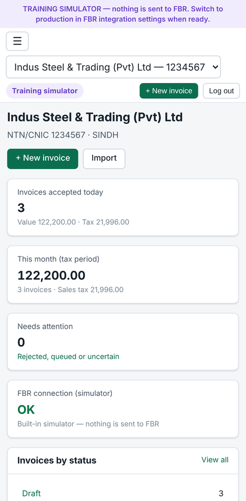
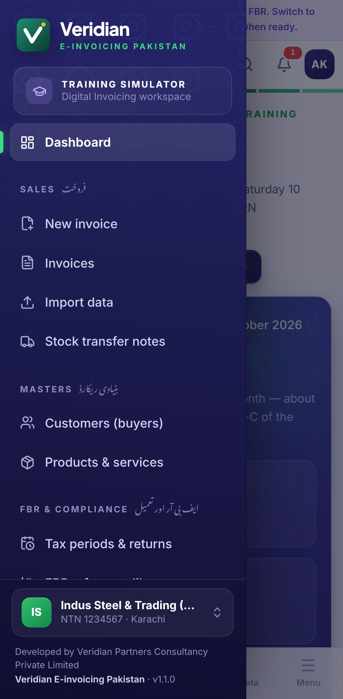
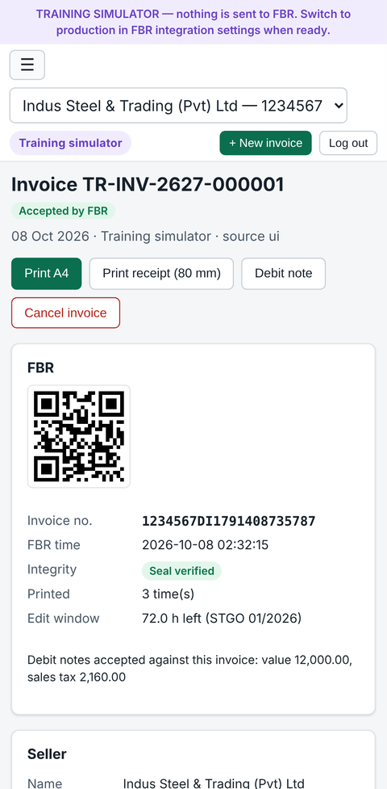
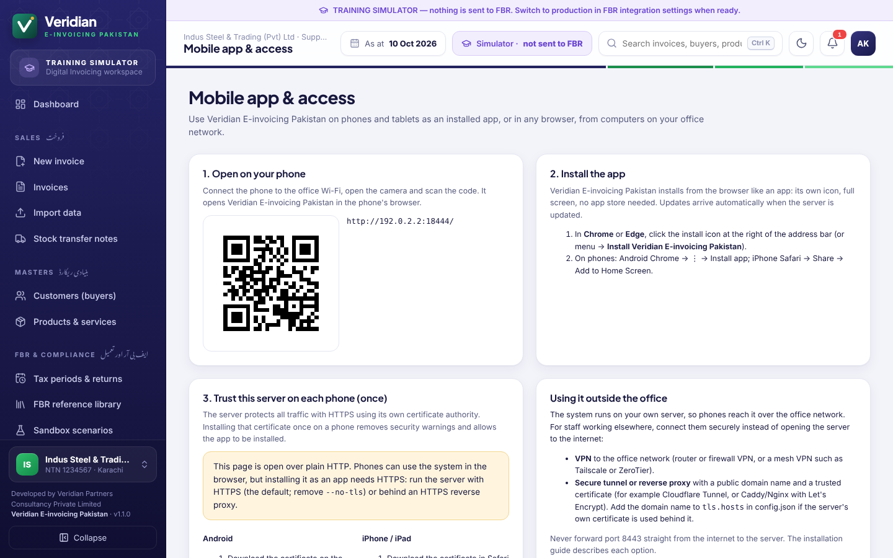

# Mobile App and Remote Access

Veridian E-invoicing Pakistan works in any modern browser on computers, tablets and phones. On phones and tablets it can also be **installed as an app** (a Progressive Web App). This gives it its own icon, a full-screen window and automatic updates, with no app store needed. The same server provides both the website and the app, so users see the same data everywhere.

---

## 1. Website access (computers and phones)

Open `https://<server-address>:8443/` in Chrome, Edge, Firefox or Safari, for example `https://192.168.1.10:8443/`. The screens adapt to the screen size:

- on phones, the menu opens from the **☰** button;
- forms show one field per row;
- wide tables scroll sideways inside their card.

**Mobile app & access** in the menu shows a QR code for each of the server's network addresses. Scan it with a phone camera to open the system on that phone.

## 2. Installing the app on a phone or tablet

Browsers only install apps from a **trusted HTTPS** connection. Do the following once per phone.

### Step 1 — Trust the server's certificate

The server creates its own certificate authority (CA) on first start and protects all traffic with HTTPS signed by it. Installing the CA certificate once on a device removes security warnings and enables app installation.

Download it from **Mobile app & access → Download certificate**, or from `https://<server-address>:8443/api/v1/system/ca.crt`.

| Device | Install the certificate |
|---|---|
| **Android** | Settings → Security → More security settings → Encryption & credentials → **Install a certificate → CA certificate** → choose the downloaded file. The menu path differs slightly between manufacturers. |
| **iPhone / iPad** | Open the download link in Safari → allow the profile → Settings → **Profile Downloaded → Install**. Then go to Settings → General → About → **Certificate Trust Settings** and turn on full trust for the certificate. |
| **Windows PCs** | Double-click the file → Install Certificate → Local Machine → "Place all certificates in the following store" → **Trusted Root Certification Authorities**. |
| **macOS** | Open the file in Keychain Access (System keychain) → set it to **Always Trust**. |

The server certificate is renewed automatically before it expires. It is also re-issued when the server's IP address changes. Devices keep trusting it because the CA stays the same. If users reach the server by a DNS name or another address (VPN), add it to `tls.hosts` in `config.json` and restart the service.

### Step 2 — Install

| Device | How |
|---|---|
| **Android (Chrome)** | Open the system → menu **⋮** → **Install app**, or use the **Install on this device** button on the Mobile app & access page |
| **iPhone / iPad (Safari)** | Open the system → **Share** → **Add to Home Screen** → Add |
| **Windows / macOS (Chrome, Edge)** | Install icon at the right of the address bar → Install |

The installed app opens straight to the login screen. Its shortcuts (long-press the icon on Android) go to **New invoice** and **Invoices**.

### What is stored on the phone

Only the application screens (HTML, scripts, icons) are cached, so the app starts quickly. Invoices, customers, reports and other business data are **never stored on the device**: every screen loads them from the server. If the server cannot be reached, the app shows "Cannot reach the server".

## 3. Using the system outside the office

The software runs on the client's own server, so phones normally reach it over the office Wi-Fi. For staff working elsewhere, connect them **securely**. **Never forward port 8443 directly from the internet.**

| Option | When to use | Notes |
|---|---|---|
| **VPN to the office network** (router/firewall VPN, or a mesh VPN such as Tailscale or ZeroTier) | Recommended for most clients | Phones get an office address and use the system exactly as in the office. Add the VPN address or name of the server to `tls.hosts`. |
| **Secure tunnel** (e.g. Cloudflare Tunnel) | Internet access without opening router ports | The tunnel provides a public HTTPS name with a publicly trusted certificate, so phones need no certificate installation. Restrict access with the tunnel's access policies. |
| **Reverse proxy** (Caddy, Nginx, IIS) with a public domain and a Let's Encrypt certificate | Clients with IT staff and a static public IP | Proxy to `https://server:8443` and keep HTTPS on the server. Allow only the needed sources in the firewall. |

The static public IP whitelisted by PRAL is for the server's **outgoing** calls to FBR. It is unrelated to how users reach the server.

## 4. Security checklist for mobile use

- Give every user their own login with the least role needed. Operators can only create and submit invoices.
- Accounts lock for 15 minutes after 5 wrong passwords. Changing a password signs out the user's other devices.
- Remove leavers' accounts promptly under **Users & roles**.
- Keep the server's CA private key (`<data>/tls/ca-key.pem`) secret. Only `ca.pem` / `ca.crt` is distributed to devices.

---

© 2026 Veridian Partners Consultancy Private Limited. All rights reserved. Veridian E-invoicing Pakistan is proprietary software.
