# User Manual

This manual is for accountants, billing staff and managers who issue sales-tax invoices with Veridian E-invoicing Pakistan.

---

## 1. Getting started

### Opening the system and logging in

- **On the computer where it is installed:** double-click the **Veridian E-invoicing Pakistan** icon on the desktop, or open it from the Start menu. It opens in a window of its own; no command window or browser tabs are involved.
- **On other computers and phones in the office:** open the address given by your administrator, e.g. `https://server:8443/`, in Chrome or Edge. Browsers can install it as an app with its own icon (see *Mobile app & access*).

Sign in. After five wrong passwords the account is locked for 15 minutes. If an administrator set or reset your password, you must choose a new one at first login: 8 or more characters, with letters and digits.

### Roles

| Role | Can do |
|---|---|
| **admin** | Everything, including users, licence, backups and API keys |
| **manager** | Company settings, FBR tokens, invoices, cancellations, scenarios, reports, audit trail |
| **accountant** | Customers, products, invoices, debit notes, cancellations, reports, incidents |
| **operator** | Create and submit invoices (counter/POS staff) |
| **auditor** | Read-only: invoices, reports, audit trail |

### Screen layout

- **Left menu:** the company selector (for multi-company installations) with the company's environment and NTN, then Sales, Masters, FBR & compliance, Settings and Support. On a phone the menu opens from the **☰** button.
- **Top bar:**
  - **Search** (or press **Ctrl K** or **/**): finds invoices by number, FBR number, buyer or NTN; buyers; products; FBR HS codes; and pages such as *Verify a buyer* or *Tax calculator*. Use the arrow keys and **Enter** to open a result.
  - the current environment, **+ New invoice**;
  - the **bell** (notifications, see below);
  - your **initials**: change password, mobile app, help, **Appearance** (light, dark or automatic) and **Log out**.
- **Coloured banner:** shows when you are **not** in production.
  - *Training simulator:* nothing is sent to FBR.
  - *FBR sandbox:* test submissions for certification.
  - Invoices from either are watermarked and are not valid tax invoices.

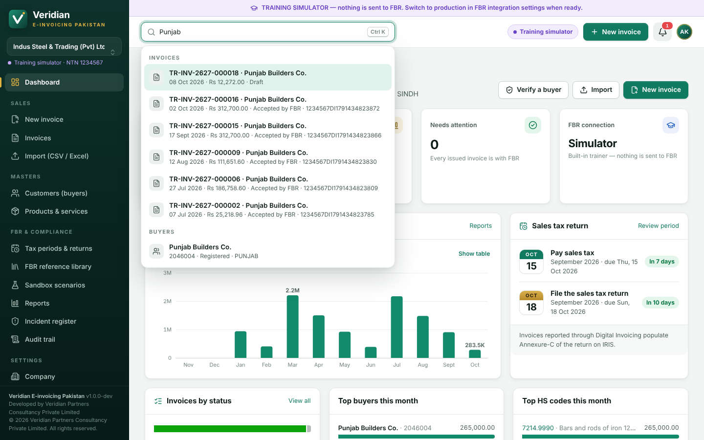

### Notifications (the bell)

The red number counts what needs action now; a blue dot means there is only information. Notifications are worked out from the current state, so each disappears by itself once its cause is dealt with. Click one to go to the page where you can fix it:

| Notification | What to do |
|---|---|
| FBR not reachable / token rejected | Check the internet connection or the token under **FBR integration**. Invoices are queued meanwhile. |
| Invoices not yet reported to FBR | Shown in red after 24 hours: invoices issued during an outage are marked as issued in the offline mode and must be uploaded within 24 hours of the connection being restored (rule 150XC). |
| Invoices rejected by FBR | Correct the errors and resubmit. |
| Submissions need reconciliation | Check the invoice on IRIS and record the outcome. |
| Draft invoices not yet issued | Issue them when the supply is made, or delete them. |
| Incidents not reported to FBR | Rule 150XA(c): report to FBR and the Commissioner within 24 hours and record the reference. |
| Pay sales tax / file the return in *n* days | Review the period on **Tax periods & returns**. |
| FBR reference data not downloaded / out of date | Download it under **FBR reference library → Data sync**. |
| Token or licence expiring, no recent backup | Renew, or check the backups (administrators). |

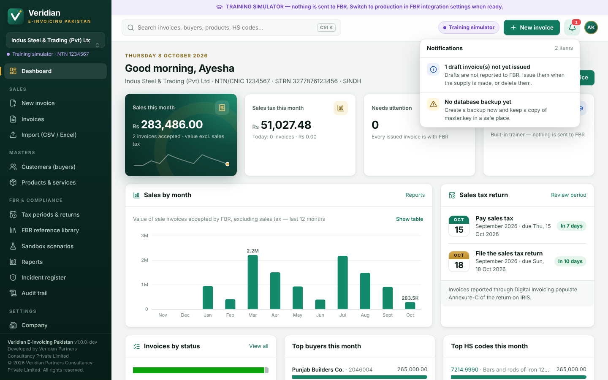

The same items can be **e-mailed** to the people responsible, so problems are seen even when nobody has the system open — see *E-mail notifications* in section 16.

### Dashboard

Shows:

- **sales this month** (value excluding sales tax, with a 12-month trend line), sales tax this month and today's invoices;
- items that need attention (rejected, queued, needing reconciliation) and FBR connection health;
- **sales by month** for the last 12 months (point at a column for its figures, or click **Show table**);
- the **sales tax return** due dates with a countdown;
- invoices by status, the top buyers and HS codes of the month, the latest invoices;
- go-live readiness and the state of FBR reference data;
- the most frequent FBR errors;
- warnings: licence, token expiry, unreported incidents, and invoices **not yet reported to FBR** with the age of the oldest one.

Sales figures by month, buyer and HS code are shown to roles that can see reports.

## 2. Customers (buyers)

**Masters → Customers (buyers) → + New customer**

| Field | Guidance |
|---|---|
| Name | Buyer's name as registered |
| NTN / CNIC | 7-digit NTN (without the check digit after the dash) or 13-digit CNIC, no dashes. **Check FBR** queries FBR's Active Taxpayer List and registration type. |

**Check all with FBR** (on the Customers page) checks every buyer that has an NTN or CNIC, one after another, and records the result with the date. A buyer whose registration type in your master differs from FBR's record is flagged **FBR says …** so that further tax is charged correctly.
| Registration type | *Registered* or *Unregistered*. Taxable supplies to unregistered buyers attract **further tax (4%)**. A registered buyer must have an NTN/CNIC. |
| Province (destination of supply) | Required by FBR |
| Sales tax withholding agent | If the buyer withholds sales tax: *fraction* (default one-fifth) or *full* |

## 3. Products & services

**Masters → Products & services → + New product**

| Field | Guidance |
|---|---|
| HS code (PCT) | Format `NNNN.NNNN`; type to search the HS list |
| Unit of measure | FBR's UoM text. For some HS codes FBR expects a particular UoM; the hint shows it. |
| Sale type | FBR's sale type, e.g. *Goods at standard rate (default)*, *Goods at Reduced Rate*, *3rd Schedule Goods*, *Exempt goods*, *Goods at zero-rate*, *Services* … |
| Rate | Pick from FBR's list for the sale type, or type it, e.g. `18%`, `5%`, `Exempt`, `Rs.200`, `18% along with rupees 60 per kilogram` |
| SRO / Schedule no., SRO item serial no. | Required for reduced-rate, exempt and other SRO-based supplies. Lists come from FBR when available. |
| Printed retail price | Third Schedule goods: the price printed on the pack, which includes sales tax. Tax = printed price × rate ÷ (100 + rate), e.g. Rs 118 → Rs 18 at 18% |
| Further tax | *Automatic* (unregistered buyers), *Always* or *Never* |
| Extra tax / FED rate | Only where applicable |
| FED type, FED rate as printed, FED Schedule / SRO, FED serial no. | For goods or services subject to federal excise duty. They are copied to each invoice line and printed, as rule 150R(13)(aa)–(ff) requires since SRO 1666(I)/2026. For a specific duty (rupees per unit), enter the rate as it should be printed, e.g. *Rs 4 per kg*, and the amount on the invoice line. |

## 4. Creating a sales tax invoice

**+ New invoice**

1. **Document:** type (*Sale Invoice* or *Debit Note*) and invoice date (today; report at the time of supply). Optionally add your reference, such as an order or ERP number; it prevents duplicates. Tick **Advance receipt invoice** when you have received payment before supplying (see *Special cases*).
2. **Buyer:** search the customer master, or type the buyer's details for a one-off sale (e.g. *Walk-in customer*, Unregistered). **Check with FBR** next to the NTN/CNIC asks FBR's Active Taxpayer List and registration type and sets *Registered* or *Unregistered* for you; a buyer picked from the master shows the status on file.
3. **Lines:** type to search products, or enter a description, then set HS code, UoM, quantity, price, sale type and rate. If FBR prescribes a different unit for the HS code, the unit is flagged with **Use** to apply FBR's unit. Click **▸ SRO, retail price, discount, further/extra tax, FED…** for the extra fields, including **Pick SRO / schedule from FBR** and **Pick serial no. from FBR**.
4. Taxes and totals are **calculated live** as you type:
   - value excluding tax, sales tax, further tax, extra tax, FED, withholding, total and amount payable;
   - warnings appear under the line; FBR's checks are listed at the top once you start entering the invoice. Put each product on one line: FBR may treat the same product on two lines as a duplicate, and the system warns about it.
5. Click **Save & submit to FBR**. **Save draft** keeps it unreported.

After submission:

- **Accepted by FBR:** the FBR invoice number and QR code appear. Print it.
- **Rejected:** the FBR errors are shown per line with *How to fix*. Click **Edit**, correct it, and submit again.
- **Errors before sending:** if the product finds problems itself (e.g. missing NTN for a registered buyer, invalid HS code), the invoice is not sent and the issues are listed.

### Special cases

| Case | How |
|---|---|
| Unregistered buyer | Further tax at 4% is added automatically to taxable lines (not to exempt or zero-rated lines). If your company is a **manufacturer or importer**, record the buyer's CNIC or NTN: section 23(1)(b) requires it and the system warns when it is missing. Other sellers are warned above Rs 100,000. |
| Third Schedule goods | Enter the retail price printed on the pack per unit (it includes sales tax). The system reports the retail value excluding sales tax to FBR and charges 18% on it, i.e. printed price × 18 ÷ 118 |
| Goods with federal excise duty | Set the FED rate (or, for a specific duty, the FED amount on the line). FED is part of the value of supply, so sales tax and further tax are charged on value + FED (section 2(46)). Enter the **FED particulars** — type, rate as printed, price per unit, FED Schedule/SRO and serial no. — in the line details or once on the product; they are printed under the line (rule 150R(13)(aa)–(ff)). The system warns when they are missing. |
| Advance received before supply | Sales tax is due at the time of supply — delivery or payment, whichever is earlier (section 2(44)) — and since the Finance Act 2026 section 23(1) requires an invoice with an FBR number for an advance receipt. Tick **Advance receipt invoice** and enter the advance (excluding sales tax) as the value. It is reported to FBR and printed as an **ADVANCE RECEIPT INVOICE**. On delivery, invoice only the balance and enter the advance invoice's FBR number under **Advance receipt invoices adjusted**. |
| Reduced rate / exempt / zero-rated | Choose the sale type and rate, and enter the SRO schedule and serial number |
| Withholding agent buyer | Set on the customer; *Amount payable* is reduced by the withheld tax |
| Discounts | Enter an amount or percentage in the line details |

## 5. Invoice statuses

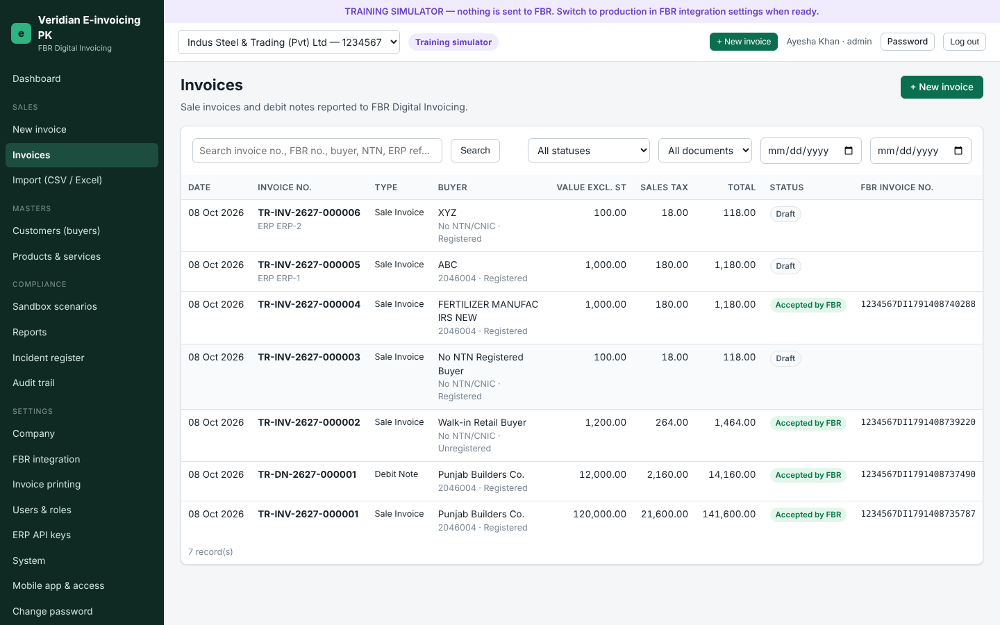

| Status | Meaning | What to do |
|---|---|---|
| **Draft** | Saved, not reported | Edit or submit |
| **Validated** | FBR validation passed, not yet reported | Submit |
| **Queued** | FBR could not be reached; the system retries automatically and resends every queued invoice as soon as the connection is back | Nothing — it is sent when FBR is reachable (**Retry now** to try at once). FBR requires invoices issued offline to be uploaded within 24 hours of the connection being restored, so check the dashboard after an outage. **Print provisional copy** gives the customer a copy marked "PENDING FBR REPORTING"; print the final copy once it is accepted. |
| **Submitting** | Being sent | Wait |
| **Accepted by FBR** | Reported; FBR number issued; locked | Print, deliver |
| **Rejected** | FBR refused it | Edit and resubmit |
| **Needs reconciliation** | No definite answer received; FBR may have recorded it | A manager/accountant checks IRIS and uses **Reconcile with IRIS** |
| **Cancelled** | Cancelled after FBR cancellation | — |

Accepted invoices **cannot be edited or deleted**. Corrections are made by debit note or by cancellation.

## 6. Printing

On an accepted invoice, click **Print A4** or **Print receipt (80 mm)**. The print shows:

- seller and buyer particulars;
- the lines with HS codes, rates and taxes;
- amount in words;
- the **FBR invoice number**, **QR code** and **FBR Digital Invoicing logo** (the official logo is built in);
- the tax period, the HS code of each line, the total discount and the tax withheld;
- the **software registration number** (Settings → FBR integration) and the **digital signature** with the signing key's fingerprint (rule 150R(4)(b));
- FED particulars under each line subject to federal excise duty;
- for invoices issued while FBR was unreachable, a note that the invoice was issued in offline mode and when FBR received it (rule 150XC).

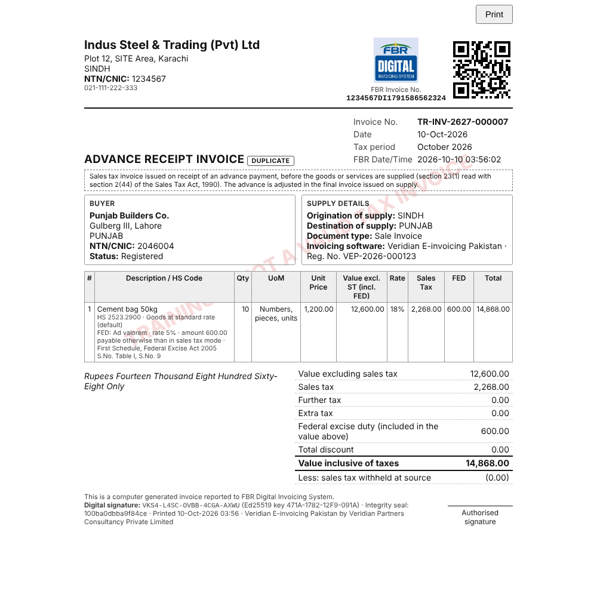

The first print is the original. Later prints are marked **DUPLICATE**.

Copies per print (buyer / seller / office copy), logo, terms and footer are set under **Settings → Invoice printing**.

## 7. Debit notes

Use a debit note when goods are **returned** or the **value of a reported sale is reduced** after supply, for example a post-sale discount or short supply.

1. Open the accepted sale invoice and click **Debit note**. A draft debit note opens with the original lines and the original FBR invoice number.
2. Reduce the quantities and values to the returned or reduced amount. A note cannot exceed the original invoice's value or sales tax.
3. Click **Save & submit to FBR**.

The original invoice shows the debit notes accepted against it. Reports list debit notes separately and deduct them from output tax ("Net sales tax" in the monthly summary).

For an upward price revision, issue a supplementary sale invoice for the difference instead.

## 8. Cancelling an invoice

FBR allows cancellation or editing through its system only **within 72 hours** of issue. After that, the **Commissioner's prior approval** is required (STGO 01 of 2026).

1. Cancel the invoice on **IRIS → Digital Invoicing**.
2. In the product, open the invoice → **Cancel invoice**. Enter the reason and the IRIS reference. After 72 hours, also enter the Commissioner's approval reference.

If your administrator has enabled FBR's cancellation service (Installation guide, `fbr.endpoints.cancelPath`), the dialog offers **Cancel with FBR** instead. The request goes straight to FBR, and the invoice is marked cancelled only when FBR confirms it.

The invoice is then marked cancelled and prints with a CANCELLED watermark.

## 9. Needs reconciliation

This appears when the connection broke after the invoice was sent, so FBR may or may not have recorded it.

1. Search IRIS for the invoice (date, buyer, value).
2. Open the invoice → **Reconcile with IRIS** and choose one:
   - **IRIS shows this invoice** → enter the FBR invoice number;
   - **IRIS does not show it** → **resubmit automatically**, or **return to draft for correction**.

Never re-enter the sale as a new invoice; it could be reported twice.

### Duplicating an invoice

For repeat sales, open an earlier sale invoice and click **Duplicate**. A new draft dated today is created with the same buyer and lines (taxes are recalculated); check it and submit it.

### Sharing an invoice

On an accepted invoice, **Share** opens the phone's share sheet (WhatsApp, e-mail and so on) with the invoice number, date, buyer, amounts and the **FBR invoice number**. On a computer the same details are copied, ready to paste. The printed or PDF copy (**Print A4**, then *Save as PDF*) remains the tax invoice.

## 10. Importing invoices (CSV / Excel)

**Import (CSV / Excel)**

1. Download the Excel or CSV template.
2. Fill one row per invoice line. Rows with the same `invoice_ref` form one invoice.
3. Choose the file and click **2. Preview & check**. Every invoice is calculated and validated, and nothing is saved.
4. Click **3. Import as drafts**, or tick *Submit each imported invoice to FBR immediately*.

Re-importing a file never duplicates invoices whose `invoice_ref` already exists.

Optional columns at the end of the template: `advance_receipt` (*yes* for an advance receipt invoice), `advance_ref` (on a final invoice, the advance invoices adjusted), and `fed_type`, `fed_rate_text`, `fed_unit_price`, `fed_sro`, `fed_sro_serial` for the FED particulars. Older files without these columns still import.

## 11. Reports

**Reports** includes only documents accepted by FBR:

- **Sales register (line level):** reconcile with Annexure-C of the sales tax return;
- **Tax summary by sale type & rate**;
- **Monthly summary (tax periods):** sale invoices, debit notes, net sales tax, tax withheld by buyers;
- **Buyer-wise summary**;
- **Annex-C reconciliation:** every document that received an FBR invoice number in the period, including those cancelled later, with the buyer, the tax amounts and whether it was issued offline. Since SRO 1666(I)/2026 (rule 150XD(2)), tax is recovered on any invoice reported with an FBR number but not accounted for in Annex-C or the return, so match each line before filing. The same file answers FBR's electronic scrutiny intimations (SRO 1655(I)/2026);
- **FBR API log:** every request and response exchanged with FBR (security tokens are never logged).

Choose the period and environment, then **Download CSV** or **Download Excel**.

## 11a. Tax periods & returns

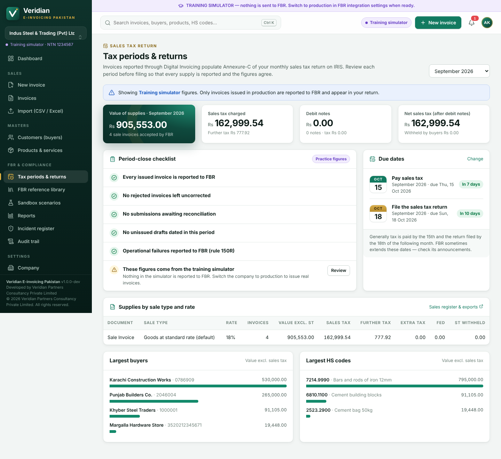

**FBR & compliance → Tax periods & returns** (roles that can see reports). Invoices reported through Digital Invoicing populate Annexure-C of the monthly sales tax return on IRIS, so review each tax period before filing:

- **Due dates** with a countdown: by default tax is paid by the 15th and the return filed by the 18th of the following month. Change the days under **Settings → Company → Sales tax return calendar** if your sector has other dates. When FBR extends the filing date for a period (by notification or circular), click **Record an FBR extension**, enter the new date and FBR's reference: reminders and the checklist then use it, and the original date is shown alongside. The payment date does not move — FBR's extensions are normally conditional on the tax being paid on time.
- **Period-close checklist:** every issued invoice reported; no rejected invoices left uncorrected; no submissions awaiting reconciliation; no unissued drafts dated in the period; incidents reported. **Review** opens the matching invoices.
- The period's value of supplies, sales tax, further tax, debit notes, net sales tax and tax withheld by buyers.
- **Supplies by sale type and rate** — the figures that feed Annexure-C — and the largest buyers and HS codes.
- Incidents that overlapped the period.
- **Annex-C reconciliation** download for the period.
- **Day, week and month closings** (rule 150R(4)(f)): the system records a closing automatically within an hour after each day, week (Monday to Sunday) and month ends — documents issued, reported, not reported and cancelled, the values and tax reported, and the first and last FBR numbers. Closings are chained by hash and cannot be changed; **Chain intact** shows they have not been tampered with.

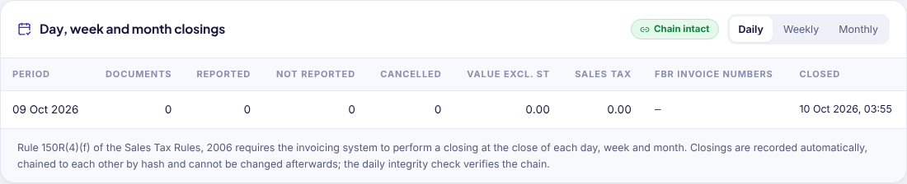

## 11b. Stock transfer notes

**Sales → Stock transfer notes.** Goods moved from your factory to your own warehouse registered under the **same STRN** are not a supply, so no invoice is reported to FBR. Sales Tax General Order 25 of 2026 requires each consignment to travel with a serially numbered stock transfer note instead.

1. Click **New transfer note**. Enter the dispatch date and time, the receiving warehouse and its address, the vehicle number, the driver's CNIC and who authorised the dispatch.
2. Add the goods: search products (the HS code and unit are filled in) or describe them, with quantity and value at cost.
3. Tick the confirmation that the warehouse is registered under your own STRN — if it has a separate STRN, the movement is a taxable supply and needs a sales tax invoice.
4. **Save and print** numbers the note (STN-000001, STN-000002 …) and prints a despatch copy and a warehouse copy.
5. When the goods arrive, click **Received** and record who signed the warehouse copy, and when. A note issued in error can be **cancelled** with a reason; it stays in the register so the series has no gaps.

**Register (CSV)** downloads the notes for the monthly reconciliation with your stock records. Notes are kept for six years like invoices.

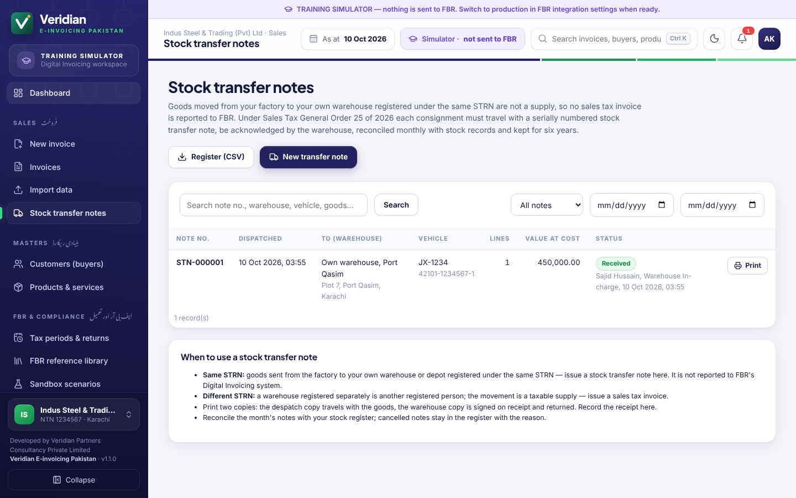

## 11c. FBR reference library

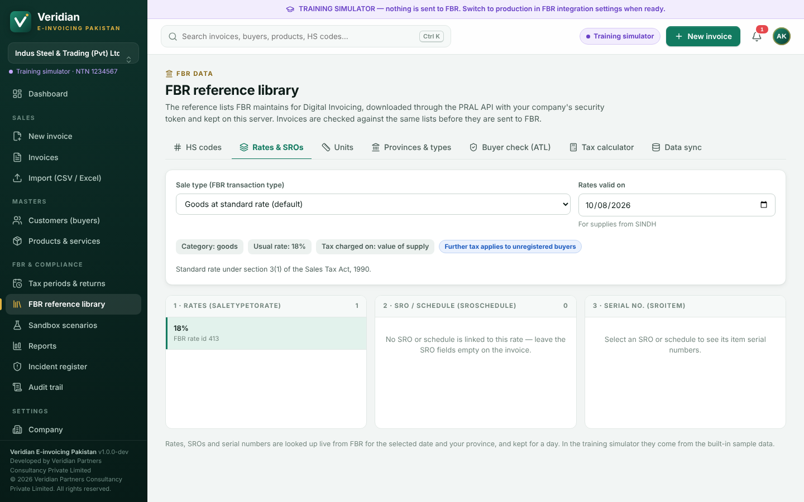

**FBR & compliance → FBR reference library** shows the lists FBR maintains for Digital Invoicing, downloaded with the company's security token:

| Tab | Use it to |
|---|---|
| HS codes | Search FBR's HS (PCT) codes by number or description; click a code for the unit of measure FBR prescribes for it (HS_UOM). |
| Rates & SROs | Pick a sale type and date: the rates FBR accepts (SaleTypeToRate) → the SROs or schedules linked to a rate → their serial numbers. These are the values to put on the invoice. |
| Units | FBR's units of measure, spelt as FBR expects them. |
| Provinces & types | Province codes, document types and transaction (sale) types. |
| Buyer check (ATL) | Check an NTN or CNIC against FBR's Active Taxpayer List and registration type, with what it means for the invoice (registered or unregistered buyer, further tax). |
| Tax calculator | Work out sales tax, further tax, extra tax, FED, withholding and the invoice total for a sale, using the same engine as invoices. |
| Data sync | See what is stored on the server and **Download from FBR now** (company settings permission). Refresh after FBR announces new sale types, rates or SROs. |

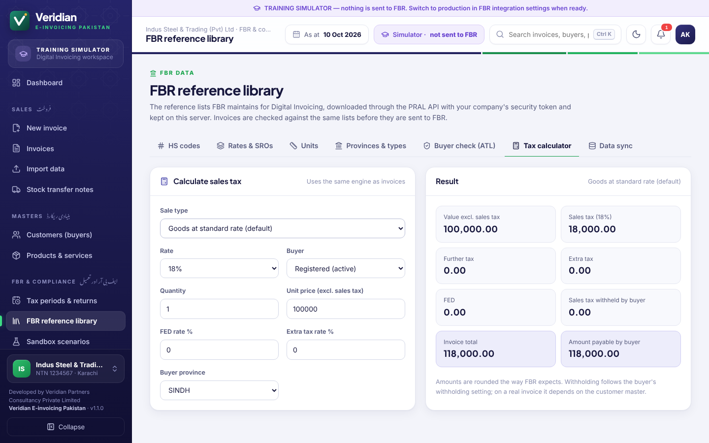

The invoice editor uses the same data: it shows FBR's unit for the HS code you enter (with **Use** to apply it), offers **Pick SRO / schedule from FBR** and **Pick serial no. from FBR** in the line details, and has **Check with FBR** next to the buyer's NTN/CNIC.

## 12. Sandbox scenarios

Used once per company before going live (see [FBR-ONBOARDING-GUIDE.md](FBR-ONBOARDING-GUIDE.md)):

- set the scenarios assigned on IRIS;
- practise them in the simulator;
- run them in the FBR sandbox until all show **passed**.

## 13. Incident register

Rule 150XA(c) and (d) require reporting any operational failure, damage, disruption or tampering of the e-invoicing system — and any inoperative hardware or software, with reasons and evidence — to FBR and the Commissioner **within 24 hours**.

- Recorded automatically:
  - loss of FBR connectivity and token failures;
  - **unexpected stops** of the system itself (crash or power failure longer than 10 minutes) for companies in production. A normal shutdown of the server or Windows service is not reported;
  - **tampering**: every day, and whenever **Verify** is clicked on the Audit trail page, the system checks the audit trail, the seal and digital signature of every accepted invoice, the signing key and the chain of closings. Any change made outside the application opens a tampering incident.
- Record other incidents with **+ Record incident** (hardware/software failure, suspected tampering).
- If an automatically recorded stop was planned (for example the server was switched off without stopping the service), edit the incident and enter a reference such as "Planned shutdown — not reportable" so it no longer shows as unreported.
- **Letter** prints the intimation to the Commissioner, copied to FBR and PRAL, with the list of affected invoices and the software registration number.
- After sending it, edit the incident and enter the date and reference. Incidents not reported within 24 hours are flagged **overdue**.

## 14. Audit trail

Every action is logged with user, time and details: logins, invoices, changes, cancellations, settings. Entries are chained by SHA-256 hashes. **Verify integrity** proves that no entry was altered or removed.

## 15. Using a phone or tablet

Open **Mobile app & access** in the menu. It has a QR code to open the system on your phone, an **Install** button (or instructions for Android and iPhone) and the certificate the phone needs to trust the server. See [MOBILE-AND-REMOTE-ACCESS.md](MOBILE-AND-REMOTE-ACCESS.md).

On a phone, the bar at the bottom of the screen opens **Home**, **Invoices**, a new invoice (the round **+** button), the **FBR data** library and the full **Menu**; the magnifier at the top opens search.

## 16. Settings

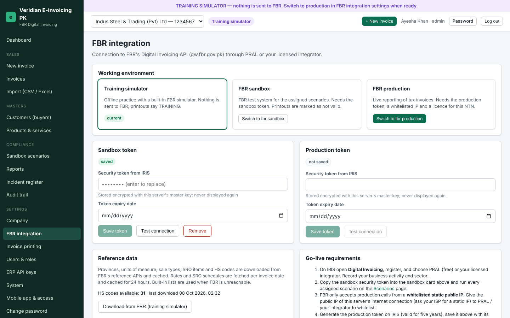

| Page | Purpose |
|---|---|
| Company | Seller particulars, business activity and sector, invoice prefixes, further-tax rate, withholding fraction, validate-before-post, sales tax return due days. **+ Add another company** for multi-company installations. |
| FBR integration | Working environment (training simulator / FBR sandbox / FBR production), sandbox and production tokens with expiry, **Test connection**, reference data download, go-live requirements. **Registration on IRIS** lists the exact technical details to enter on IRIS (system provider, software type, version, business nature, sector), finds this server's public IP for PRAL's IP whitelisting and keeps the **software registration number**. **“Integrated with FBR” signboard** prints the signboard each outlet must display (rule 150R(11)). |
| Invoice printing | Default format, amount-in-words style, columns, copies, terms, footer, company logo |
| Users & roles | Create users, assign roles and companies, reset passwords, deactivate leavers |
| ERP API keys | Keys for ERP/POS integration ([ERP-INTEGRATION-API.md](ERP-INTEGRATION-API.md)) |
| System & licence | Licence status and installation, backups (create/download), FBR Digital Invoicing logo, server information, the **digital signature key** (fingerprint and public key for auditors), **e-mail notifications** |
| Help & error codes | All 108 FBR error codes in FBR's words with fixes, compliance rules, a summary of FBR's FAQs, the official documents and the licensed integrators, sale types and rates |

### Registration on IRIS and the signboard

**Settings → FBR integration** shows the technical details to enter on IRIS, finds this server's public IP for whitelisting, keeps the software registration number and prints the "Integrated with FBR" signboard.

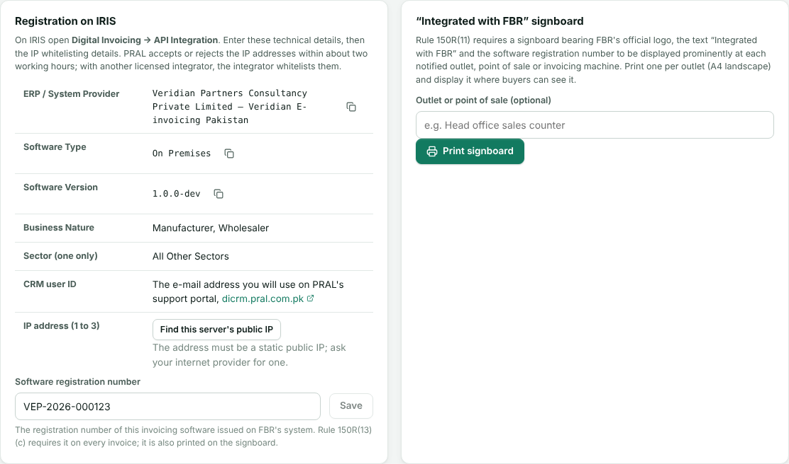

**Help & error codes → Documents & integrators** links FBR's official notifications and technical documents and lists the licensed integrators.

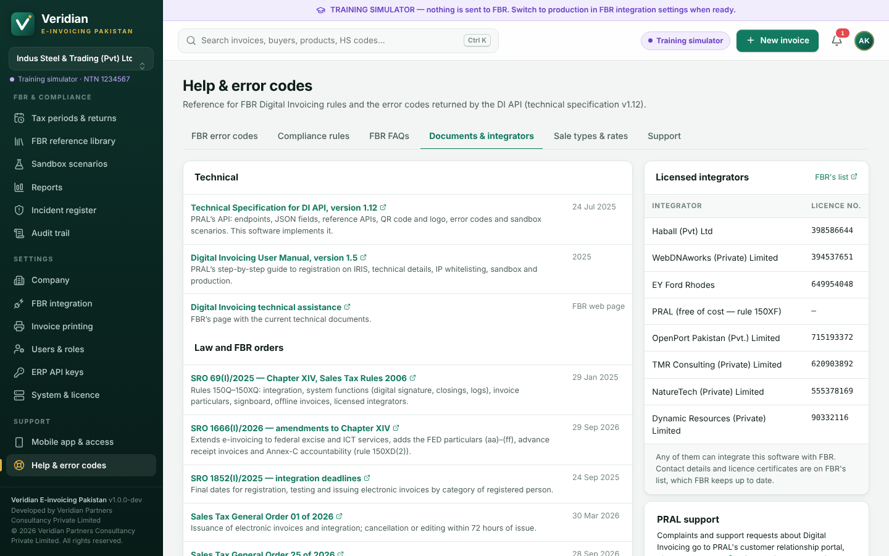

### E-mail notifications

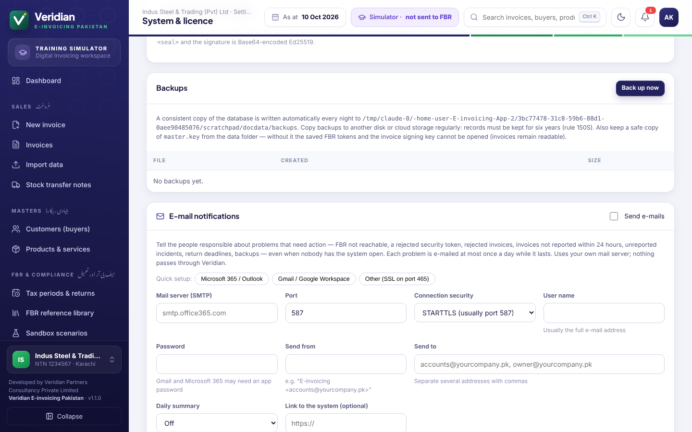

**Settings → System & licence → E-mail notifications** (administrators). The e-mails go through your own mail server; nothing passes through Veridian.

1. Click **Microsoft 365 / Outlook** or **Gmail / Google Workspace** to fill in the server, port and security, or enter your mail server's details.
2. Enter the user name (usually the full e-mail address) and password. Microsoft 365 and Gmail may require an *app password* when two-step sign-in is on. The password is stored encrypted.
3. Enter the sender, and the recipients separated by commas.
4. Choose whether problems are e-mailed as soon as they are found (checked every 5 minutes), and whether to receive a **daily summary** at a chosen hour (yesterday's and this month's invoices and tax, the return due dates and open items).
5. Optionally enter the address of the system (for example `https://192.168.1.10:8443`) so that the e-mails link to it.
6. Tick **Send e-mails** and click **Save & send test e-mail**. The result of the last e-mail is shown below the form.

Each problem is e-mailed at most once a day while it lasts, and again if it recurs after being fixed. Companies working in the training simulator do not raise e-mails about invoices. The server must be able to reach the mail server (usually TCP port 587 or 465).

---

© 2026 Veridian Partners Consultancy Private Limited. All rights reserved. Veridian E-invoicing Pakistan is proprietary software.
